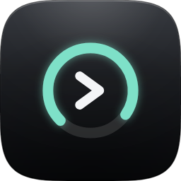

<p align="center">
  
</p>

# CodexLens

CodexLens is a native macOS app that gives you a clear view of your local Codex usage. It reads session data from `~/.codex` and shows:

- all-time, monthly, and daily authenticated OpenAI usage
- date filter presets plus a custom date range picker
- model-by-model token breakdowns
- recent tracked threads
- estimated API-style cost using editable per-model rates

It intentionally excludes MiniMax usage from the totals.

Use it when you want a fast menu bar answer to: how many tokens did I use, which models drove the total, and what would that usage cost at API-style rates?

## Requirements

- macOS 14 or newer
- Codex installed and used locally on the same Mac
- Swift 6.2+ if you want to build from source

## Run locally

```bash
./script/build_and_run.sh
```

## Verify locally

```bash
swift run CodexUsageTracker --self-check
```

## Build release artifacts

```bash
./script/package_release.sh zip
./script/package_release.sh dmg
./script/package_release.sh both
```

Artifacts are written to `dist/release/`.

## Install for end users

Unsigned builds can work, but macOS Gatekeeper may warn on first launch.

1. Open the `.dmg`
2. Drag `CodexLens.app` to `Applications`
3. Right-click the app in `Applications` and choose `Open`
4. If needed, allow it in `System Settings -> Privacy & Security`

If a downloaded build is quarantined, users can remove the quarantine attribute:

```bash
xattr -dr com.apple.quarantine /Applications/CodexLens.app
```

## Notes

- Cost is an estimate, not Codex billing truth
- Default pricing is based on the public OpenAI API pricing page
- Tool-call fees, discounts, taxes, and internal billing differences are not included
